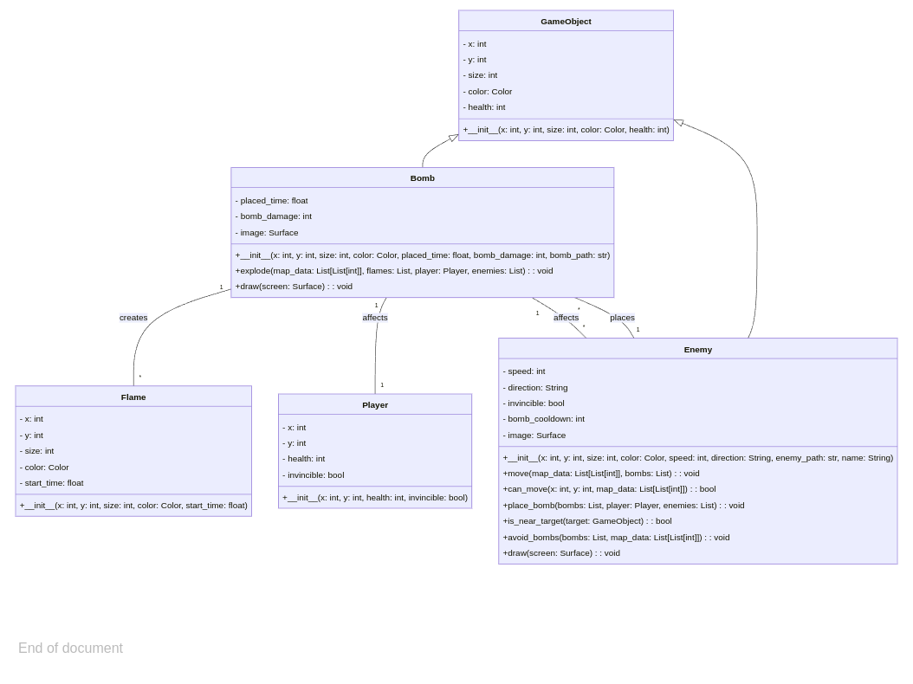

# Game Demo


# Class Diagram of main program


# Tasks before running the game
## Team Leader
1. Create a **Docker Hub account**.
2. Log in your docker hub and create a new repository to store the built images. Make sure to set it to `Public`
3. Enter the directory `~/oop-proj-bomber-man/Docker`
4. Enter your own docker hub account and repository in `build.sh`, `docker_run.sh` and `docker_join.sh`
5. Let your team members know where the built image will be.

## Team Member
1. Create a **Docker Hub account**.
2. Log in your docker hub.
3. Enter the directory `~/oop-proj-bomber-man/Docker`
3. Enter your team leader's docker hub account, repository and tag name **ONLY** in the `docker_run.sh` and `docker_join.sh`

# Use Docker As Root
First open the terminal and type
```
$ sudo groupadd -f docker
```
Then type the following usermod command to add the active user to the **docker** group
```
$ sudo usermod -aG docker $USER
```
Apply the group changes to the current terminal session by typing
```
$ newgrp docker
```
Finally check if the **docker** group is in the list of user groups
```
$ groups
```

# How to run the game
First enter the repo
```
$ cd oop-proj-bomber-man
```
Build the docker image first (team leader only)
```
./docker_build
```
The process requires docker hub account. There will be messages about loggin in to docker hub account before you build the image.

After the images is built and pushed to docker hub, both team leader and member can run
```
$ source Docker/build.sh
```
過程中若出現需要docker login，請使用自己的Docker Hub account登入

完成後再執行
```
$ source Docker/docker_run.sh 或 $ ./docker_run
```
If the docker container is in process, please run
```
$ ./docker_join
```
Run this command to enter the game after the container is running
```
# python3 main.py
```

# Game Rules
[Game Rules](Game_Rules.md)