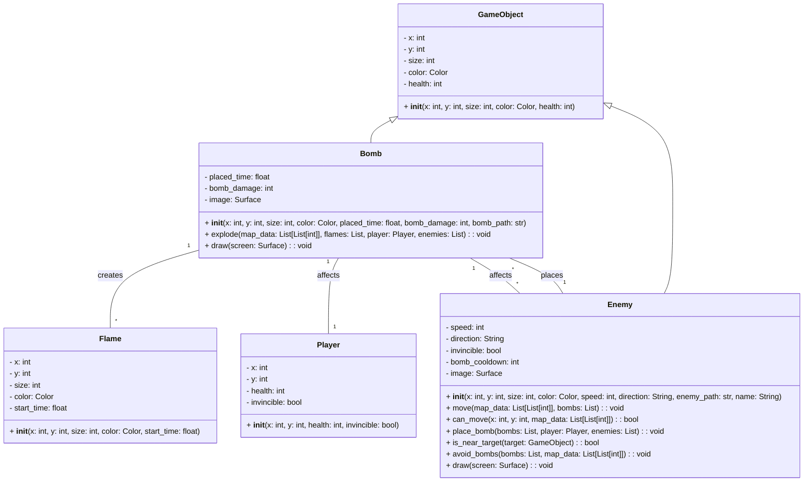

```mermaid
classDiagram
    class GameObject {
        - x: int
        - y: int
        - size: int
        - color: Color
        - health: int
        + __init__(x: int, y: int, size: int, color: Color, health: int)
    }

    class Bomb {
        - placed_time: float
        - bomb_damage: int
        - image: Surface
        + __init__(x: int, y: int, size: int, color: Color, placed_time: float, bomb_damage: int, bomb_path: str)
        + explode(map_data: List[List[int]], flames: List<Flame>, player: Player, enemies: List<Enemy>): void
        + draw(screen: Surface): void
    }

    class Flame {
        - x: int
        - y: int
        - size: int
        - color: Color
        - start_time: float
        + __init__(x: int, y: int, size: int, color: Color, start_time: float)
    }

    class Player {
        - x: int
        - y: int
        - health: int
        - invincible: bool
        + __init__(x: int, y: int, health: int, invincible: bool)
    }

   class Enemy {
        - speed: int
        - direction: String
        - invincible: bool
        - bomb_cooldown: int
        - image: Surface
        + __init__(x: int, y: int, size: int, color: Color, speed: int, direction: String, enemy_path: str, name: String)
        + move(map_data: List[List[int]], bombs: List<Bomb>): void
        + can_move(x: int, y: int, map_data: List[List[int]]): bool
        + place_bomb(bombs: List<Bomb>, player: Player, enemies: List<Enemy>): void
        + is_near_target(target: GameObject): bool
        + avoid_bombs(bombs: List<Bomb>, map_data: List[List[int]]): void
        + draw(screen: Surface): void
    }

    GameObject <|-- Bomb
    GameObject <|-- Enemy
    Bomb "1" -- "*" Flame : creates
    Bomb "1" -- "1" Player : affects
    Bomb "1" -- "*" Enemy : affects
    Enemy "1" -- "*" Bomb : places
    
```
